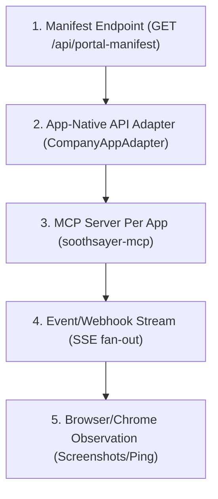

# App-Native Workbench Integration

**Version**: 0.1.0  
**Status**: Specification  

---

## 1. Core Philosophy

MYAI Portal is built on the principle that **app-native interfaces and governed manifest/API bridges are the primary path** for integrating with enterprise applications. 

Rather than relying on brittle browser scraping or DOM scanning, the portal communicates directly with structured telemetry exposed natively by target applications. 

### Why App-Native is Preferred
- **Structured Truth**: APIs and structured manifests provide deterministic data schema, not guessed or scraped layouts.
- **Security & Authorization**: Scope boundaries can be defined and audited cleanly at the API gateway layer using role-aware scopes and secure SSO.
- **Lower Fragility**: Changes to a web app's visual structure (DOM, class names) will not break the integration, which is the primary failure mode of browser-scraping interfaces.
- **Observation Fallback**: Deployed browser automation (like Chrome Extensions) is restricted to a passive observation layer for capturing authenticated screenshots or performing layout pings, rather than extracting internal system data or executing changes.

---

## 2. Integration Ladder

Ecosystem applications integrate with the portal using a structured, progressive integration ladder. This allows systems to begin with zero-setup read-only dashboards and gradually elevate to governed mutations.



### 1. Manifest Endpoint
The target application exposes a standardized, read-only JSON payload at `/api/portal-manifest`. This provides core environment information (name, health, version, route list, active workflows). This is the easiest, zero-setup first step.

### 2. App-Native API Adapter
For legacy or complex enterprise applications, the portal utilizes a clean, server-side interface adapter:
```typescript
interface CompanyAppAdapter {
  id: string;
  appName: string;
  manifest(): Promise<AppManifest>;
  health(): Promise<AppHealth>;
  workflows(): Promise<Workflow[]>;
  proposeAction(action: unknown): Promise<ProposedAction>;
}
```

### 3. MCP Server Per App
The strongest integration fit is for applications to expose an app-specific **Model Context Protocol (MCP) server** (e.g. `soothsayer-mcp`). This equips the portal's LLM routing layer with structured, schemas-gated tools:
- `get_app_manifest`
- `list_routes`
- `get_health`
- `list_workflows`
- `create_review_proposal`
- `request_deploy_verification`

### 4. Event/Webhook Stream
The application POSTs append-only execution and state events back to the portal's EventSource bus (`/api/ingest/:source`) to update the intelligence feed in real-time.

### 5. Browser/Chrome Observation
A lightweight observation extension or browser container (e.g. Apple Container browser viewport) pings the web page for reachability, captures visual snapshots for the MacBook simulator card, or tracks visible UX status.

---

## 3. Chrome Observation Capability Contract

Browser/Chrome integrations must operate strictly within a passive observation contract. They are forbidden from overriding manifest truth or calling direct mutations.

```typescript
interface BrowserObservationCapability {
  id: 'browser-observation' | 'chrome-authenticated-observation';
  enabled: boolean;
  sourceLabel: 'browser observation';
  permissions: Array<'screenshot' | 'page-title' | 'console-summary' | 'network-summary'>;
  authenticated: boolean;
  mutationAllowed: false;
}
```

---

## 4. Enterprise Identity & Role-Aware Cards

When deployed inside a company workspace, the app-native connection becomes highly secure:
- **SSO Identity**: Portal matches the active operator session to company SSO credentials.
- **Role-Aware Views**: Portal persona lenses (Engineer, PM, BA, QA, Exec) filter layout views, but backend MCP tool permissions remain scoped strictly to the employee's company authorization level.
- **Audit Logs**: Every proposal, check, or approval is logged deterministically with signature hashes to verify completion.
- **Propose-Before-Mutate**: Any modification is structured as a `ProposedAction` card requiring manual human gate clearance before dispatch.
